# GTAE-IDS: Graph Transformer-Based Autoencoder for Intrusion Detection
## Official System Architecture Document — Review-II Milestone

> **Document Status**: FROZEN FOR REVIEW-II  
> **Milestone Boundary**: Fully implemented and validated up to Layer 5 (113-Dimensional Downstream Feature Extraction). Layers 6, 7, and 8 represent defined future work and are strictly non-implemented.

---

## 1. Executive Architecture Summary

GTAE-IDS is a self-supervised, graph-native network intrusion detection system designed to detect zero-day and anomalous network flows on the LSPR23 benchmark without relying on ground-truth attack labels during representation learning.

The architecture processes raw network flows through temporal graph construction, applies a dual-decoder Graph Transformer Autoencoder (GTAE) to learn structural host and flow representations from normal traffic, and produces a rich 113-dimensional flow anomaly representation combining latent flow topology with reconstruction error residuals.

```mermaid
flowchart TD
    %% Styling Classes
    classDef implemented fill:#0f172a,stroke:#3b82f6,stroke-width:2px,color:#f8fafc;
    classDef implementedSub fill:#1e293b,stroke:#0284c7,stroke-width:1.5px,color:#f1f5f9;
    classDef auditFix fill:#1e1b4b,stroke:#818cf8,stroke-width:2px,stroke-dasharray: 5 5,color:#ede9fe;
    classDef future fill:#1c1917,stroke:#f59e0b,stroke-width:2px,stroke-dasharray: 4 4,color:#fef3c7;
    classDef futureSub fill:#292524,stroke:#d97706,stroke-width:1px,stroke-dasharray: 3 3,color:#fde68a;

    subgraph L1 ["LAYER 1: DATA ACQUISITION (IMPLEMENTED)"]
        A1["LSPR23 Raw PCAP / Flow Dataset<br/>(~16 Million Raw Flow Records)"]:::implemented
    end

    subgraph L2 ["LAYER 2: DATA PREPROCESSING (IMPLEMENTED)"]
        B1["Chunked Streaming Reader<br/>(50k flows/chunk)"]:::implementedSub
        B2["Cleaning & Imputation<br/>(Inf/NaN handling, zero outlier clipping)"]:::implementedSub
        B3["Feature Selection<br/>(76 continuous flow metrics, leak-free)"]:::implementedSub
        B4["Experimental Stratified Subset<br/>(100,000 flows: 90k benign, 10k attack; seed=42)"]:::implementedSub
        B1 --> B2 --> B3 --> B4
    end
    A1 --> B1

    subgraph L3 ["LAYER 3: TEMPORAL GRAPH CONSTRUCTION (IMPLEMENTED)"]
        C1["Temporal Slicing<br/>(300-second / 5-minute non-overlapping windows)"]:::implementedSub
        C2["Host Nodes V_t<br/>(Unique IP entities, local indexing)"]:::implementedSub
        C3["Flow Edges E_t<br/>(Directed SrcIP -> DstIP connections)"]:::implementedSub
        C4["Node Features (16-D)<br/>(Topological & behavioral flow statistics)"]:::implementedSub
        C5["Edge Attributes (81-D)<br/>(76 flow metrics + 1 DstPort + 4 Proto one-hot)"]:::implementedSub
        C6["PyTorch Geometric Snapshots<br/>(298 temporal graph objects, 100k total flows)"]:::implementedSub
        C1 --> C2 & C3
        C2 --> C4
        C3 --> C5
        C4 & C5 --> C6
    end
    B4 --> C1

    subgraph L4 ["LAYER 4: CLEAN GTAE LEARNING (IMPLEMENTED)"]
        D1["Chronological Split<br/>(Train: 208 win / Val: 44 win / Test: 46 win)"]:::implementedSub
        
        subgraph AUDIT ["Training-Time Contamination Audit & Correction"]
            D_old["FLAWED (Pre-Audit):<br/>Mixed Window Flows -> Contaminated x -> Filter edges"]:::auditFix
            D_fix["CORRECTED (Clean):<br/>Benign Edges (y=0) -> Recompute Benign x -> Isolated nodes receive 0.0"]:::auditFix
            D_old -.->|"Audited & Fixed"| D_fix
        end

        D2["Leak-Free Feature Normalization<br/>(Edge & Node StandardScaler fitted strictly on benign train)"]:::implementedSub
        D3["Graph Transformer Autoencoder<br/>(2x TransformerConv, 4 heads, 54,401 params)"]:::implementedSub
        D4["Latent Representation Bottleneck<br/>(Flow Latent z_e: 32-D | Node Latent h_v: 32-D)"]:::implementedSub
        D5["Dual Decoders & Reconstruction<br/>(Edge Decoder -> 81-D | Node Decoder -> 16-D)"]:::implementedSub
        D6["Clean Model Checkpoint<br/>(best_gtae_model_clean.pt | Val Loss: 0.100571)"]:::implementedSub

        D1 --> D_fix --> D2 --> D3 --> D4 --> D5 --> D6
    end
    C6 --> D1

    subgraph L5 ["LAYER 5: DOWNSTREAM FEATURE EXTRACTION (IMPLEMENTED)"]
        E1["GTAE Inference Engine<br/>(Frozen clean checkpoint in eval mode)"]:::implementedSub
        E2["Latent Flow Vector<br/>(z_e in R^32)"]:::implementedSub
        E3["Reconstruction Error Residual<br/>(|edge_attr - edge_recon| in R^81)"]:::implementedSub
        E4["Downstream Feature Matrix f_e (113-D)<br/>(f_e = [z_e, abs_recon_error])"]:::implementedSub
        E5["Flow Metadata & Evaluation Labels<br/>(window_id, timestamp, flow_idx | y in {0, 1} isolated)"]:::implementedSub
        E6["Serialized Feature Artifacts<br/>(Train: 57,305 benign | Val: 17,331 | Test: 22,462)"]:::implementedSub

        E1 --> E2 & E3 --> E4
        E1 --> E5
        E4 & E5 --> E6
    end
    D6 --> E1
    C6 -.->|"Inference Graphs"| E1

    %% FREEZE BOUNDARY
    BOUND["================ REVIEW-II IMPLEMENTATION FREEZE BOUNDARY ================"]

    subgraph L6 ["LAYER 6: ANOMALY DETECTORS (PLANNED - NOT IMPLEMENTED)"]
        F1["One-Class SVM (OCSVM)<br/>[FUTURE]"]:::futureSub
        F2["Isolation Forest (iForest)<br/>[FUTURE]"]:::futureSub
        F3["HBOS (Histogram-Based)<br/>[FUTURE]"]:::futureSub
        F4["INNE (Nearest Neighbor)<br/>[FUTURE]"]:::futureSub
    end
    E6 -.->|"X_train_benign (57,305 x 113)"| F1 & F2 & F3 & F4

    subgraph L7 ["LAYER 7: ENSEMBLE DECISION ENGINE (PLANNED - NOT IMPLEMENTED)"]
        G1["Score Normalization & Calibration<br/>[FUTURE]"]:::futureSub
        G2["Majority / Soft Voting Engine<br/>[FUTURE]"]:::futureSub
        G3["Binary Classification Decision<br/>(Normal vs. Malicious Flow)<br/>[FUTURE]"]:::futureSub
        G1 --> G2 --> G3
    end
    F1 & F2 & F3 & F4 -.-> G1

    subgraph L8 ["LAYER 8: IDS OPERATIONAL OUTPUT (PLANNED - NOT IMPLEMENTED)"]
        H1["Real-Time Stream Inference<br/>[FUTURE]"]:::futureSub
        H2["Alert Generation & Root-Cause Attribution<br/>[FUTURE]"]:::futureSub
        H3["FastAPI Backend Integration<br/>[FUTURE]"]:::futureSub
        H4["Security Analyst Dashboard<br/>[FUTURE]"]:::futureSub
        H1 --> H2 --> H3 --> H4
    end
    G3 -.-> H1
```



---

## 2. Layer-by-Layer Architectural Specification

### Layer 1: Data Acquisition (Implemented)
- **Source**: LSPR23 network flow benchmark (`data/raw/ls23pr_flows.zip`).
- **Characteristics**: Approximately 16 million network flows collected from realistic production and attack scenarios.
- **Components**:
  - Raw flow records with network 5-tuple (SrcIP, DstIP, SrcPort, DstPort, Protocol), timestamps (`mTimestampStart`, `mTimestampLast`), ground-truth annotations (`Label`), and raw network metric counters.

### Layer 2: Data Preprocessing (Implemented)
- **Source Files**: [src/preprocessing/pipeline.py](file:///c:/Users/Aniket%20Patil/Desktop/GTAE-IDS/src/preprocessing/pipeline.py), [src/preprocessing/schema.py](file:///c:/Users/Aniket%20Patil/Desktop/GTAE-IDS/src/preprocessing/schema.py), [run_preprocessing.py](file:///c:/Users/Aniket%20Patil/Desktop/GTAE-IDS/run_preprocessing.py).
- **Core Operations**:
  1. **Chunked Streaming**: Incremental chunk reading (50,000 flows/chunk) to operate comfortably within system memory.
  2. **Numerical Cleaning**: Replaces `+/-Inf` with `NaN`, followed by deterministic median imputation calculated strictly from valid observations.
  3. **No Outlier Clipping**: Extreme traffic bursts (high packet/byte counts) represent legitimate intrusion behavior and are strictly preserved.
  4. **Identifier Isolation**: IP addresses and flow IDs are stripped from numerical input matrices and preserved exclusively for graph construction metadata.
  5. **Approved Metrics**: 76 continuous statistical flow features extracted (`FLOW_FEATURE_COLUMNS`).
- **Experimental Development Subset**:
  - Path: `data/processed/lspr23_dev_100k.pkl`
  - Total Flows: **100,000**
  - Class Distribution: **90,000 benign flows (90.0%)** and **10,000 malicious flows (10.0%)**.
  - Seed: Deterministic reproducibility with `seed=42`.

---

### Layer 3: Temporal Graph Construction (Implemented)
- **Source Files**: [src/graph/graph_builder.py](file:///c:/Users/Aniket%20Patil/Desktop/GTAE-IDS/src/graph/graph_builder.py), [src/graph/feature_extraction.py](file:///c:/Users/Aniket%20Patil/Desktop/GTAE-IDS/src/graph/feature_extraction.py), [src/graph/validator.py](file:///c:/Users/Aniket%20Patil/Desktop/GTAE-IDS/src/graph/validator.py).
- **Graph Formalism**:
  - Let $G_t = (V_t, E_t, X_t, A_t)$ denote the directed multigraph observed during 5-minute temporal window $t \in \{0, \dots, 297\}$.
  - **Nodes ($V_t$)**: Unique network host endpoints (identified by IP) active in window $t$. Node IDs are local to snapshot $t$.
  - **Edges ($E_t$)**: Individual directed network flows from `SrcIP` to `DstIP`. Parallel flows are preserved as distinct edges.
  - **Temporal Window**: Fixed 300-second (5-minute) non-overlapping intervals:
    $$\text{window\_idx} = \left\lfloor \frac{t_{\text{start}} - t_{\text{origin}}}{300 \times 10^6 \, \mu\text{s}} \right\rfloor$$
- **Node Feature Definition ($X_t \in \mathbb{R}^{|V_t| \times 16}$)**:
  - Strict incident-flow topological & behavioral metrics:
    - `0–2`: Normalized In-Degree, Out-Degree, Total Degree.
    - `3–6`: $\log_{10}(1 + \text{fwd\_bytes})$, $\log_{10}(1 + \text{bwd\_bytes})$, $\log_{10}(1 + \text{fwd\_pkts})$, $\log_{10}(1 + \text{bwd\_pkts})$.
    - `7–10`: Mean packet size sent/received, mean flow duration sent/received.
    - `11`: $\text{SYN} / (1 + \text{SYN} + \text{RST})$ sent.
    - `12`: Protocol diversity ($|\text{Protocols}| / 5.0$).
    - `13`: Destination port diversity ($\log_{10}(1 + |\text{DstPorts}|)$).
    - `14`: Peer diversity ($|\text{Partners}| / \text{max\_partners}$).
    - `15`: $\text{RST} / (1 + \text{fwd\_pkts})$ sent.
- **Edge Attribute Definition ($A_t \in \mathbb{R}^{|E_t| \times 81}$)**:
  - 76 continuous flow metrics + 1 normalized DstPort ($\text{DstPort} / 65535.0$) + 4 protocol one-hot indicators (TCP, UDP, ICMP, Other).
- **Target Isolation**:
  - Edge ground-truth labels are stored in separate evaluation vector $y \in \{0, 1\}^{|E_t|}$.
- **Dataset Artifact**:
  - Path: `data/processed/graphs/temporal_graph_snapshots.pt` (36.11 MB, 298 temporal snapshots, 100,000 total edges, 34,646 accumulated nodes).

---

### Layer 4: Clean GTAE Learning (Implemented)
- **Source Files**: [src/models/gtae.py](file:///c:/Users/Aniket%20Patil/Desktop/GTAE-IDS/src/models/gtae.py), [src/models/normalization.py](file:///c:/Users/Aniket%20Patil/Desktop/GTAE-IDS/src/models/normalization.py), [src/models/training.py](file:///c:/Users/Aniket%20Patil/Desktop/GTAE-IDS/src/models/training.py).
- **Chronological Data Partitioning**:
  - **Training Set**: First 208 windows (70.0%) — 60,207 total flows.
  - **Validation Set**: Next 44 windows (15.0%) — 17,331 flows.
  - **Test Set**: Final 46 windows (15.0%) — 22,462 flows.
  - No window shuffling; strict temporal ordering maintained.
- **Training-Time Contamination Audit & Correction**:
  > [!IMPORTANT]
  > **Audit Finding**: Initial baseline training suffered from partial contamination: while malicious edges were filtered from training graphs, `snapshot.x` was originally computed from all mixed flows in each window, leaking attack behavioral statistics into node features and `node_scaler`.  
  > **Applied Fix**: Recomputed training node features $x$ strictly from benign edges ($y == 0$) using `construct_node_features_from_edges()`. Nodes with only attack connections (isolated nodes) receive exact 0.0 default features while preserving node indexing. Scalers (`edge_scaler`, `node_scaler`) are fitted exclusively on benign training data (57,305 edge rows; 22,722 node rows). Zero attack or validation/test data enters scalers.
- **Model Architecture**:
  - **Encoder**: 2 `TransformerConv` layers with 4 multi-head attention heads, processing node features ($16$-D) with edge attributes ($81$-D) into node latents $h_v \in \mathbb{R}^{32}$.
  - **Edge Latent MLP**: Concatenates $h_u$, $h_v$, and $edge\_attr$ to produce edge latent $z_e \in \mathbb{R}^{32}$.
  - **Edge Decoder**: 3-layer MLP projecting $z_e \to \hat{e} \in \mathbb{R}^{81}$.
  - **Node Decoder**: 3-layer MLP projecting $h_v \to \hat{x} \in \mathbb{R}^{16}$.
  - **Trainable Parameters**: **54,401**.
- **Optimization & Hardware**:
  - Loss: $\mathcal{L} = \text{SmoothL1}(edge\_attr, \hat{e}) + 0.5 \times \text{SmoothL1}(x, \hat{x})$.
  - Optimizer: AdamW (`lr=1e-3`, `weight_decay=1e-4`) with `ReduceLROnPlateau`.
  - Checkpoint: `data/processed/models/best_gtae_model_clean.pt` (Epoch 30, Best Val Loss: **0.100571**, Train Time: **19.54s** on NVIDIA GTX 1650).

---

### Layer 5: Downstream Feature Extraction (Implemented)
- **Source Files**: [src/detection/feature_pipeline.py](file:///c:/Users/Aniket%20Patil/Desktop/GTAE-IDS/src/detection/feature_pipeline.py), [src/detection/dataset.py](file:///c:/Users/Aniket%20Patil/Desktop/GTAE-IDS/src/detection/dataset.py), [run_feature_extraction.py](file:///c:/Users/Aniket%20Patil/Desktop/GTAE-IDS/run_feature_extraction.py).
- **Representation Construction**:
  For each flow edge $e = (u, v)$:
  $$f_e = \left[ z_e \;\|\; |edge\_attr - \hat{e}| \right] \in \mathbb{R}^{113}$$
  where $z_e \in \mathbb{R}^{32}$ captures structural graph embedding, and $|edge\_attr - \hat{e}| \in \mathbb{R}^{81}$ captures reconstruction residual error.
- **Inference Invariance**:
  - **Training Split**: Evaluated on $G_t^{benign}$ representations ($y == 0$, 57,305 benign flows).
  - **Validation & Test Splits**: Evaluated on complete observed graph snapshots ($G_t$) using frozen training scalers (17,331 validation flows; 22,462 test flows).
- **Metadata Separation**:
  - `window_id`, `edge_time` ($\mu$s timestamp), `edge_indices_in_window`, `src_nodes`, `dst_nodes`, and `scalar_recon_error` (MAE) are preserved in separate parallel tensors.
  - Ground-truth labels $y$ are stored strictly as isolated evaluation tensors.
- **Extracted Artifacts**:
  - `data/processed/artifacts/gtae_features_train.pt` (57,305 flows, 54.16 MB)
  - `data/processed/artifacts/gtae_features_val.pt` (17,331 flows, 16.38 MB)
  - `data/processed/artifacts/gtae_features_test.pt` (22,462 flows, 21.23 MB)
  - `data/processed/artifacts/gtae_features_metadata.json` (1.5 KB)

---

## 3. Review-II Implementation Boundary (FROZEN)

```
===================================================================================
                         REVIEW-II FREEZE BOUNDARY
   [IMPLEMENTED UP TO HERE]                 [STRICTLY FUTURE / PLANNED]
   Layers 1 - 5 (Validated)                  Layers 6 - 8 (Non-Implemented)
===================================================================================
```

---

### Layer 6: Future Anomaly Detection (Planned — Not Implemented)
- **Status**: **NOT YET IMPLEMENTED** (Scheduled for Review-III / Phase 3).
- **Objective**: Fit 4 complementary unsupervised / one-class anomaly detectors exclusively on `X_train_benign` ($57,305 \times 113$):
  1. **One-Class SVM (OCSVM)**: Kernel boundary estimation for high-dimensional support.
  2. **Isolation Forest (iForest)**: Subspace tree isolation for point anomalies.
  3. **Histogram-Based Outlier Score (HBOS)**: Unsupervised histogram density estimation.
  4. **Isolation-based Nearest Neighbor Ensemble (INNE)**: Hyper-sphere isolation robust to local density variations.
- **Output**: Continuous anomaly scores $s_i(e) \in \mathbb{R}$ for each detector $i \in \{1, 2, 3, 4\}$.

### Layer 7: Future Ensemble Decision Engine (Planned — Not Implemented)
- **Status**: **NOT YET IMPLEMENTED** (Scheduled for Review-III / Phase 3).
- **Objective**:
  1. **Score Normalization**: Normalize detector outputs to $[0, 1]$ via min-max or rank scaling.
  2. **Threshold Calibration**: Optimize decision thresholds $\tau_i$ using validation PR-AUC and F1 scores.
  3. **Voting Logic**: Majority consensus ($k \ge 3$) or soft weighted average to produce binary decision $\hat{y}_e \in \{0, 1\}$.

### Layer 8: Future IDS Operational Output (Planned — Not Implemented)
- **Status**: **NOT YET IMPLEMENTED** (Scheduled for Review-III / Phase 4).
- **Objective**:
  1. **Streaming / Windowed Evaluation**: Real-time sliding window graph construction and GTAE inference.
  2. **Explainable Alerts**: Attribution of top reconstructed error features explaining *why* a flow was flagged.
  3. **Backend API**: FastAPI endpoints serving detection results.
  4. **Security Dashboard**: Real-time visualization of host graph topology and threat indicators.

---

## 4. Verification & Validation Summary

| Requirement | Implementation Reality | Status |
| :--- | :--- | :--- |
| **Clean Checkpoint Provenance** | Model loaded strictly from `best_gtae_model_clean.pt` | Verified |
| **Node Input Dimension** | 16 features ($x \in \mathbb{R}^{|V_t| \times 16}$) | Verified |
| **Edge Attribute Dimension** | 81 features ($edge\_attr \in \mathbb{R}^{|E_t| \times 81}$) | Verified |
| **Latent Dimension** | 32 dimensions ($z_e \in \mathbb{R}^{32}$) | Verified |
| **Combined Anomaly Feature Dim** | 113 dimensions ($f_e = [z_e, \|edge\_attr - \hat{e}\|]$) | Verified |
| **Trainable Model Parameters** | 54,401 parameters | Verified |
| **Temporal Snapshots** | 298 snapshots across 100,000 flows | Verified |
| **Train / Val / Test Split** | 208 / 44 / 46 non-overlapping chronological windows | Verified |
| **Training Flows (Benign-Only)** | 57,305 flows ($100\%$ benign, $0$ attack in $X_{train}$) | Verified |
| **Validation Flows (Complete)** | 17,331 flows (14,779 benign, 2,552 attack) | Verified |
| **Test Flows (Complete)** | 22,462 flows (17,916 benign, 4,546 attack) | Verified |
| **Target Label Isolation** | $y$ strictly stored in separate 1D vectors, never in $X$ | Verified |
| **Numerical Quality** | Zero NaN / Inf across all 97,098 feature rows | Verified |
| **Anomaly Detectors Status** | OCSVM, iForest, HBOS, INNE strictly unbuilt | Verified |
